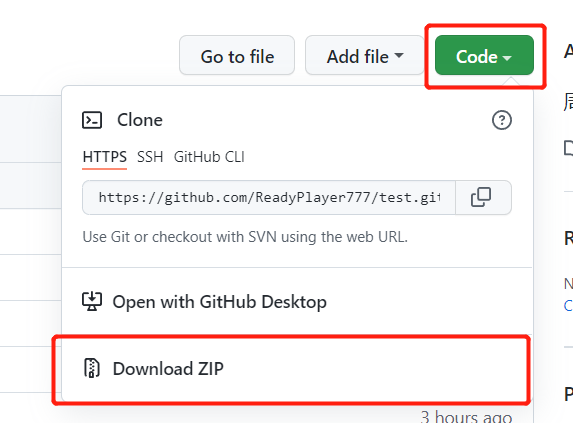
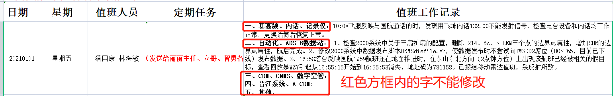
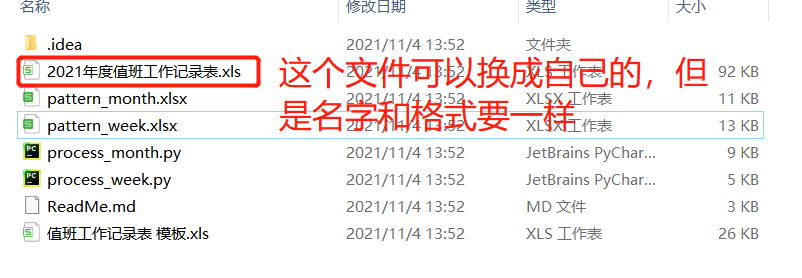
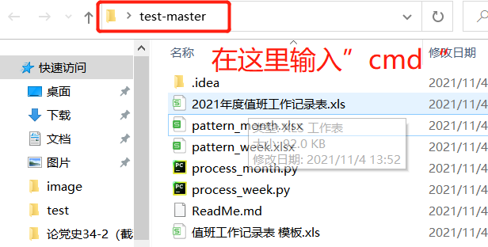
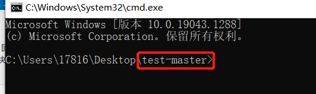
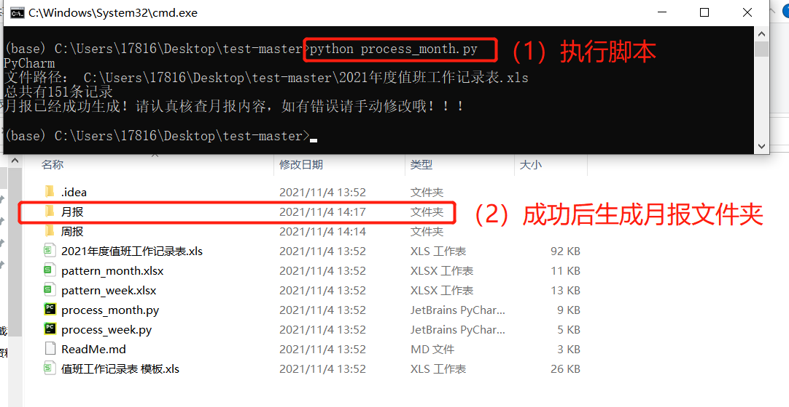
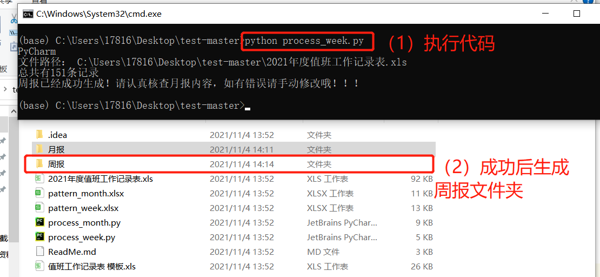
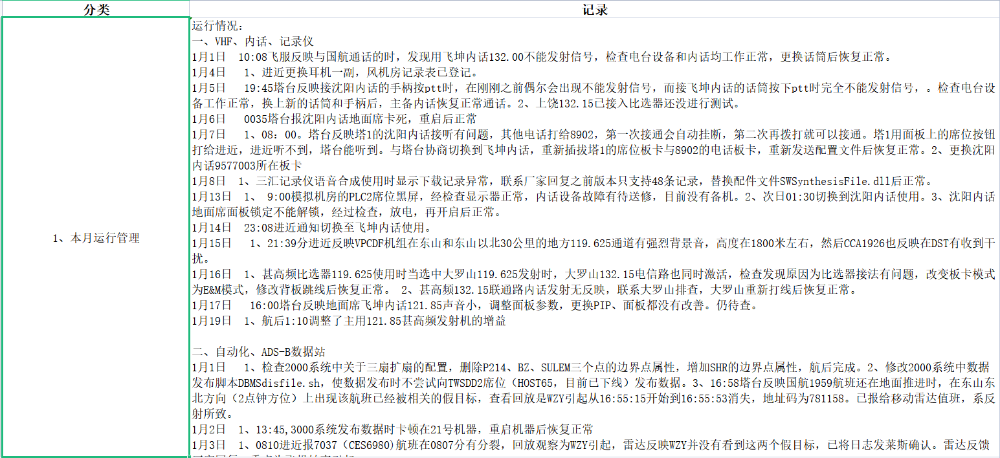
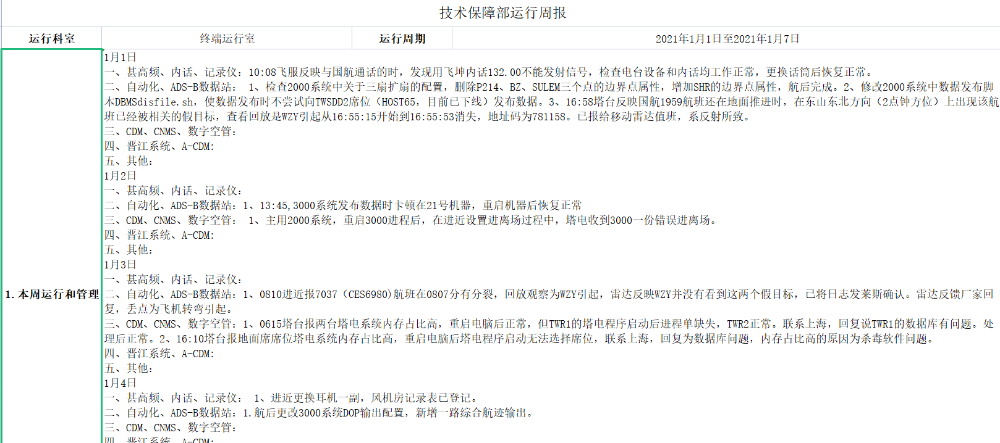

# - 说明
脚本目前可能存在许多欠缺考虑之处，可联系我们进行修改
# - 背景
终端运行室存在完成周报统计和月报统计的需求，根据年度值班工作记录表来进行周报和月报的生成，单单依靠手工统计需要消耗大量的时间，期间还有操作错误的风险，因此，这个脚本可以自动根据年度值班工作记录表来快速生成该年的周报和月报内容。

# - 下载代码
点击绿色按钮Code，Download ZIP下载压缩包到本地，无需安装，解压即可使用

# - 文件解释以及注意事项
（1）值班工作记录表 模板.xls：脚本处理数据依据的模板，也是值班工作中记录内容的地方，允许填写“日期”、“星期”、“值班人员”、“定期任务”，需要注意的是 “值班工作记录”不允许修改固定内容——
一、甚高频、内话、记录仪： 
二、自动化、ADS-B数据站： 
三、CDM、CNM、数字空管：
四、晋江系统、A-CDM:
五、其他：

允许在冒号后面添加内容，修改固定内容会影响数据处理。

（2）2021年度值班工作记录表.xls：实际的范例，也可用于运行脚本浏览月报和周报的结果

（3）pattern_month.xlsx：生成月报的模板

（4）pattern_week.xlsx：生成周报的模板

（5）ReadMe：说明书 

# - 使用方法以及环境要求
（1）环境要求：python环境，要求有环境有xlrd、openpyxl、parse包

（2）使用方法：

1、下载zip到本地后解压会得到一个test-master文件夹

2、可以直接使用2021年度值班工作记录表.xls文件或者将这个文件换成那你自己的值班工作记录表，注意：若使用自己值班工作记录表，先删除2021年度值班工作记录表.xls，再将自己值班工作记录表重命名成2021年度值班工作记录表.xls

3、使用cmd进入test文件夹，生成周报命令 python ./process_week.py  生成月报命令 python ./process_month.py

4、成功执行后在test文件夹下会生成“周报”和“月报”文件，下图是生成的月报和周报效果截图

# - 已知存在问题
该脚本只是初稿，已知存在的问题是目前的局限，无伤大雅，并不影响正常的使用，后续可以进行调整和修改。

（1）文件后缀固定不能修改，python读写文件使用的包是针对特定后缀文件来的，如openpyxl只对xlsx文件有效

（2）文件名固定，数据来源只能是“2021年度值班工作记录表.xls”，假如我们的文件叫做“2022年度值班工作记录表.xls”，也只能把它改成2021才能执行代码，这一点可以改进，但不影响正常使用

（3）月报生成可能会缺失最后一个月，由于每月月报是在20号生成的，假如“2021年度值班工作记录表.xls”中最后一个月的结尾不是20号，那么月报就会少一个月，这点也可以改进
# - Contributors
技术保障部 邵益鹏 张恒

时间：2021年11月4日
